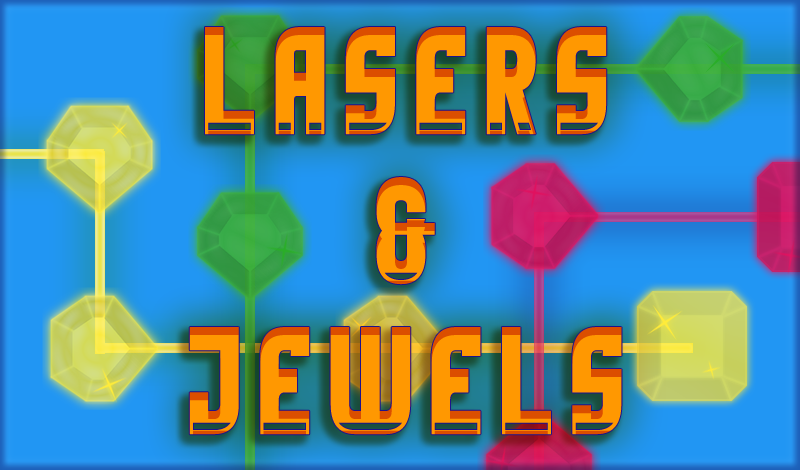
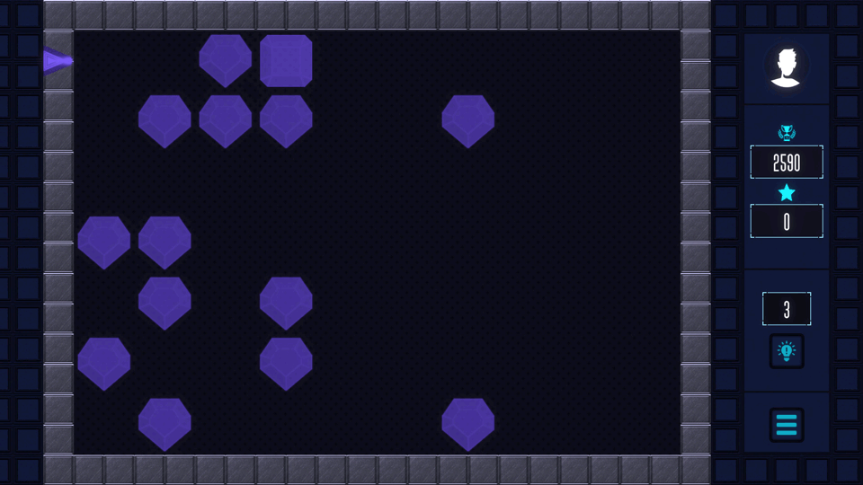

 

> The game "Lasers & Jewels" offers the player the opportunity to control the laser beam with jewels in order to solve an endless number of puzzles. The game is suitable for developing logical thinking and entertainment.
>> The goal of the game is to guide the laser beam through all the jewels to the final one. 
>> There are four types of levels in the game:
>> - "simple" - one laser and one final jewel;
>> - "paired" - two lasers and two final jewels;
>> - "two-to-one" - two lasers, one final jewel, and an "adder" that combines the two laser beams and emits a new beam;
>> - "one-to-two" - one laser, two final jewels, and a "splitter" that splits the laser beam into two.
>>
>> White jewels transmit laser beams of any color; colored ones transmit only beams of their own color. 
>> With each cycle, the number of gems increases, making the puzzle more difficult and challenging your logic. 
>> Immerse yourself in the fascinating world of puzzles and enjoy the game! 

 

 

 

